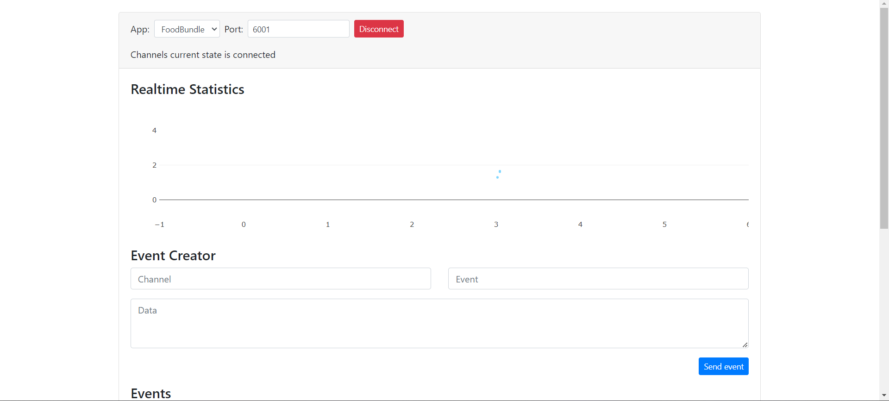
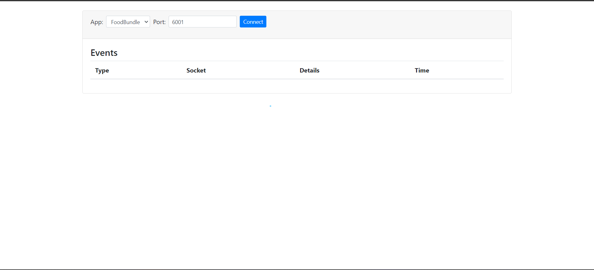

# Laravel WebSockets with Vue.js Integration

This guide provides step-by-step instructions on how to integrate Laravel WebSockets with Vue.js for real-time communication.
Follow these steps to set up the environment and start using WebSockets in your Laravel application.

## Laravel WebSockets Installation

1. Install the Laravel WebSockets package:

    ```bash
    composer require beyondcode/laravel-websockets
    ```
    
2. Publish migrations and run them:

    ```bash
    php artisan vendor:publish --provider="BeyondCode\LaravelWebSockets\WebSocketsServiceProvider" --tag="migrations"
    php artisan migrate
    ```
3. Publish the WebSocket configuration file:

    ```bash
    php artisan vendor:publish --provider="BeyondCode\LaravelWebSockets\WebSocketsServiceProvider" --tag="config"
    ```
    
4. Uncomment `App\Providers\BroadcastServiceProvider::class` in `config/app.php`.

5. Install Pusher PHP server:

    ```bash
    composer require pusher/pusher-php-server 
    ```
 6. Update your `.env` file:

    ```env
    BROADCAST_DRIVER=pusher

    PUSHER_APP_ID=local
    PUSHER_APP_KEY=local
    PUSHER_APP_SECRET=local
    PUSHER_APP_CLUSTER=mt1
    ```
7. Configure broadcasting in `config/broadcasting.php`:

    ```php
    'pusher' => [
        'driver' => 'pusher',
        'key' => env('PUSHER_APP_KEY'),
        'secret' => env('PUSHER_APP_SECRET'),
        'app_id' => env('PUSHER_APP_ID'),
        'options' => [
            'cluster' => env('PUSHER_APP_CLUSTER'),
            'encrypted' => true,
            'host' => '127.0.0.1',
            'port' => 6001,
            'scheme' => 'http',
        ],
    ],
    ```
8. Create a new event:

    ```bash
        php artisan make:event NameEvent
    ```
    ### Replace `Notif` with the name of the event you created (`Notif` in this case). This is how you broadcast the event in your controller to send real-time notifications.
    Update `Notif.php` to implement `ShouldBroadcastNow`:

    ```php
    use Illuminate\Contracts\Broadcasting\ShouldBroadcastNow;
    use Illuminate\Queue\SerializesModels;

    class Notif implements ShouldBroadcastNow
    {
        use SerializesModels;

        private $notif;

        public function __construct($notif)
        {
            $this->notif = $notif;
        }

        public function broadcastWith()
        {
            return ['message' => $this->notif];
        }

        public function broadcastOn()
        {
            return new Channel('public');
        }
    }
    ```

9. Broadcast the event in your controller:

    In your controller where you want to broadcast the event:

    ```php
    use App\Events\NotifEvent;

    // Your code logic here

    broadcast(new Notif("test"));
    ```

11.Run the WebSockets server:
  ```bash
    php artisan websockets:serve
  ```

12.Open the Laravel WebSockets dashboard in your browser. You can access it at to confirm that a new connection has been established.

  ```bash
   http://localhost:8000/laravel-websockets 
  ```
  style="display: flex; justify-content: space-between;"
             
   </div>
 
13.To verify that WebSocket communication is working, you can perform a simple test by broadcasting an event in your Laravel application.

 Create a test route in your routes/web.php file

  ```php
    use App\Events\Notif;
    
    Route::get('/broadcast', function () {
        broadcast(new Notif());
        return "Event has been sent!";
    });
  ```


Feel free to customize and expand on each step based on your project's specific requirements.
